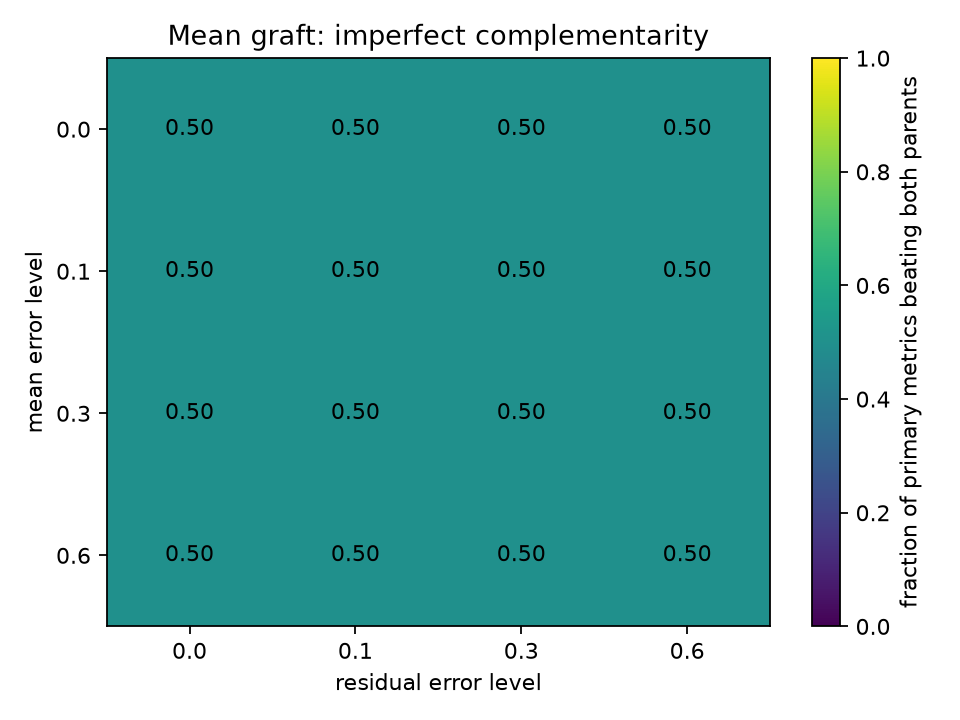
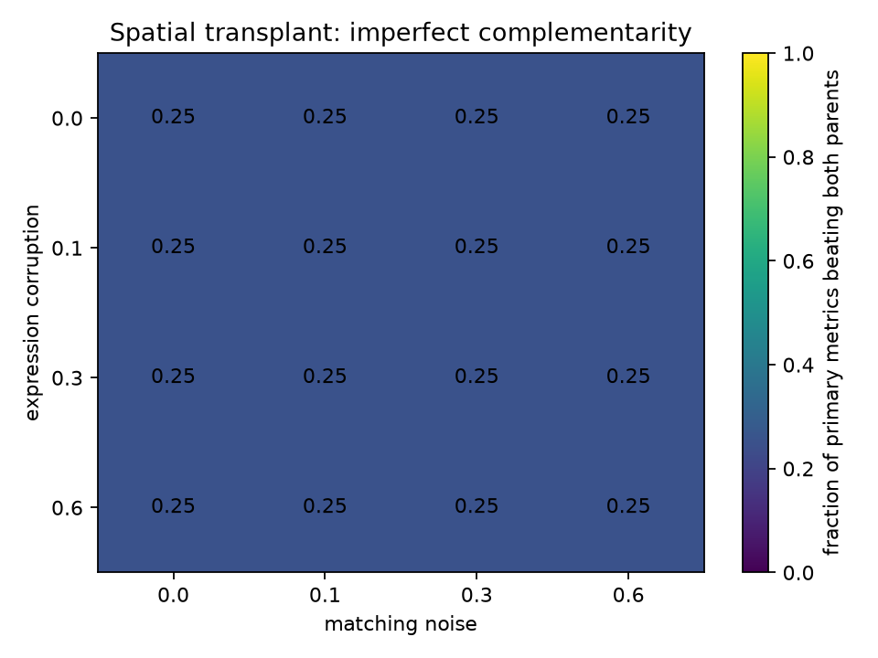

# Ensemble regime-map results

Scorer pinned to `aristoteleo/veckit@46d41e63f42a9aab815db20b742feeccd249cb17`.

These use the organizers' public mini targets. The exact cases in `RESULTS.md` remain implementation checks; here the parents are only imperfectly complementary.

`primary_win_fraction` is the fraction of task primary metrics on which the blend is strictly better than both parents. T1 uses DE score, DE direction, MMD and variogram. T2 also includes d2 shape, sliced Wasserstein, occupancy Dice and neighborhood MMD.

## Official floor baselines

The challenge defines `copy_last` as the T1/T2 floor and `wt_identity` as the T3 floor.

| task     | baseline    |   de_score |   de_direction |   mmd_u |   variogram |
|:---------|:------------|-----------:|---------------:|--------:|------------:|
| T1       | copy_last   |          0 |              0 | 0.07716 |    0.00187  |
| T2-heart | copy_last   |          0 |              0 | 0.29037 |    0.098139 |
| T3       | wt_identity |          0 |              0 | 0.04623 |    0.032556 |

## Mean graft

Summary: `{"imperfect_grid_points": 15, "points_with_any_primary_win": 15, "points_with_half_or_more_primary_wins": 15, "max_primary_wins": 2}`



## Quantile graft

Summary: `{"imperfect_grid_points": 15, "points_with_any_primary_win": 15, "points_with_half_or_more_primary_wins": 15, "max_primary_wins": 2}`


## Spatial transplant

Summary: `{"imperfect_grid_points": 15, "points_with_any_primary_win": 15, "points_with_half_or_more_primary_wins": 0, "max_primary_wins": 2}`



### Hungarian versus greedy

|   matching_noise | assignment   |   coordinate_rmse |   mean_match_distance |   sliced_wasserstein |   occupancy_dice |   neighborhood_mmd |
|-----------------:|:-------------|------------------:|----------------------:|---------------------:|-----------------:|-------------------:|
|              0   | hungarian    |       5.09523e-06 |              16.795   |                    0 |                1 |           -0.00389 |
|              0   | greedy       |       5.09523e-06 |              16.795   |                    0 |                1 |           -0.00389 |
|              0.1 | hungarian    |       5.09523e-06 |               3.17632 |                    0 |                1 |           -0.00389 |
|              0.1 | greedy       |       5.09523e-06 |               3.17632 |                    0 |                1 |           -0.00389 |
|              0.3 | hungarian    |       5.09523e-06 |               3.88354 |                    0 |                1 |           -0.00389 |
|              0.3 | greedy       |       5.09523e-06 |               3.88354 |                    0 |                1 |           -0.00389 |
|              0.6 | hungarian    |       5.09523e-06 |               5.53865 |                    0 |                1 |           -0.00389 |
|              0.6 | greedy       |      81.7486      |               5.91216 |                    0 |                1 |            0.00119 |

## Population mixtures

Whole-cell mixtures have no factor-preservation guarantee, so the table varies parent complementarity and alpha directly.

|   complementarity_severity |   alpha |   primary_wins_vs_both |   primary_losses_vs_both |   primary_win_fraction |
|---------------------------:|--------:|-----------------------:|-------------------------:|-----------------------:|
|                       0.25 |    0.25 |                      0 |                        1 |                   0    |
|                       0.25 |    0.5  |                      1 |                        1 |                   0.25 |
|                       0.25 |    0.75 |                      2 |                        0 |                   0.5  |
|                       0.5  |    0.25 |                      1 |                        0 |                   0.25 |
|                       0.5  |    0.5  |                      1 |                        0 |                   0.25 |
|                       0.5  |    0.75 |                      1 |                        0 |                   0.25 |
|                       0.75 |    0.25 |                      1 |                        0 |                   0.25 |
|                       0.75 |    0.5  |                      1 |                        0 |                   0.25 |
|                       0.75 |    0.75 |                      1 |                        0 |                   0.25 |

## Raw outputs

Every grid cell and parent/blend metric is in `regime_results/`. Reproduce with:

```bash
pip install -r requirements.txt
python regime_map.py --out-dir regime_results
```
