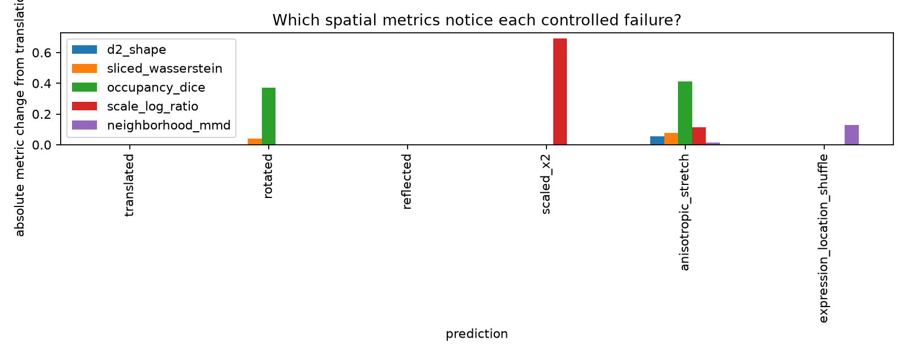
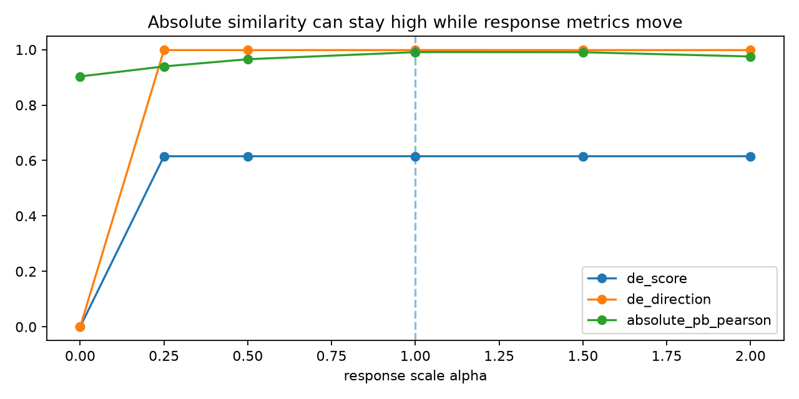

# Intuition Lab results

Generated with the public `veckit` scorer pinned to `46d41e63f42a9aab815db20b742feeccd249cb17`.

These are **teaching controls on known public targets**, not held-out benchmark results.

## Task 1

| controlled prediction | pseudobulk Pearson | MMD | variogram/CSS | composition JSD |
|---|---:|---:|---:|---:|
| row_order_only | 1 | -0.00813 | 0 | 0 |
| repeated_mean | 1 | 0.2613 | 0.01884 | 0.0131 |
| gene_wise_shuffle | 1 | 0.2463 | 0.000166 | 0.0132 |
| one_state_only | 0.9328 | 0.1966 | 0.01376 | 0.7336 |

## Task 2

| controlled prediction | shape distance | sliced Wasserstein | occupancy Dice | scale log-ratio | neighborhood MMD |
|---|---:|---:|---:|---:|---:|
| translated | 0.00126 | 0 | 1 | -0 | -0.00793 |
| rotated | 0.00126 | 0.03846 | 0.6275 | 0 | -0.00793 |
| reflected | 0.00126 | 0 | 1 | -0 | -0.00793 |
| scaled_x2 | 0.00126 | 0 | 1 | 0.6931 | -0.00793 |
| anisotropic_stretch | 0.05617 | 0.07799 | 0.5895 | 0.1136 | 0.00818 |
| expression_location_shuffle | 0.00126 | 0 | 1 | 0 | 0.121 |

### The rotation audit changed how to read this table

The 67° `rotated` row is a proper rigid rotation of the exact same point cloud, yet the current public scorer penalizes sliced Wasserstein and occupancy Dice for some proper rotations. A separate 72-angle + 50-random-SO(3) audit traced this to independently signed PCA frames: opposite-handed PCA canonicalizations are exactly the cases that fail. See [`rotation_audit.py`](rotation_audit.py), the committed audit outputs, and [upstream issue #7](https://github.com/aristoteleo/veckit/issues/7).

The older reflection observation still matters separately: `d2_shape` is reflection-blind by construction. Do not treat either phenomenon as a statement about biological laterality performance.

## Task 3

| controlled prediction | DES | DCS | severity slope | absolute pseudobulk Pearson |
|---|---:|---:|---:|---:|
| alpha_0 | 0 | 0 | -6.908 | 0.9033 |
| alpha_0.25 | 0.6154 | 0.9984 | -1.492 | 0.9394 |
| alpha_0.5 | 0.6154 | 0.9984 | -0.799 | 0.9654 |
| alpha_1 | 0.6154 | 0.9984 | -0.1059 | 0.991 |
| alpha_1.5 | 0.6154 | 0.9984 | 0.2996 | 0.9907 |
| alpha_2 | 0.6154 | 0.9984 | 0.5873 | 0.9753 |
| reversed | -0.1282 | -0.9525 | -6.908 | 0.7987 |
| shuffled | -0.0769 | -0.0101 | -6.908 | 0.8386 |

The raw CSVs are in [`results/`](results/).
