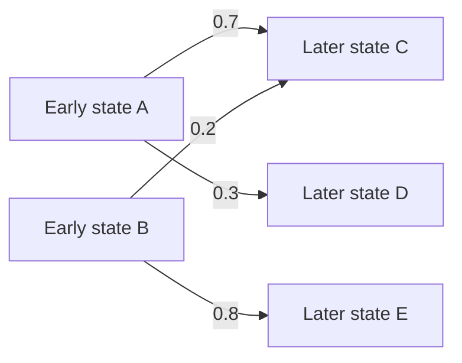

# Virtual Embryo for ML people

If you already know what scRNA-seq, MERFISH, AnnData, differential expression, and pseudobulk mean, you can skim the first third. If you mostly know transformers, diffusion, representation learning, or standard supervised ML, this guide is written for you.

The challenge documentation tells you precisely what files are legal and how scoring works. This guide is trying to answer a different question:

> **What kind of prediction problem is this, in ML terms?**

That sounds basic, but getting it wrong leads to surprisingly sensible-looking models that optimize the wrong object.

---

## 1. Start with the object you are predicting

A standard supervised dataset often looks like

\[
(x_i, y_i),
\]

where one input example has one target.

Virtual Embryo is not like that.

At one developmental stage, you observe many cells. For Task 1, each cell is represented by its gene-expression vector

\[
x_i \in \mathbb{R}^{G}.
\]

Stack the cells and you get a matrix

\[
X_t \in \mathbb{R}^{n_t \times G}.
\]

- one **row** = one measured cell
- one **column** = one gene
- one **entry** = the released, log-normalized expression signal for that gene in that cell

For Task 1, \(G=32{,}285\). Tasks 2 and 3 use a 500-gene MERFISH panel and also attach a 3D coordinate to each cell.

The most important word above is **many**.

The target is not one expression vector. It is a whole *population* of cells.

A useful abstraction is

\[
X_t \sim p_t(x),
\]

where \(p_t\) is the distribution of cell states present at developmental time \(t\).

Your submission is another sample from a distribution you hope looks like the real future or mutant embryo:

\[
\hat X_t \sim q_\theta(x \mid \text{observed development, condition}).
\]

You do not need to use a probabilistic model to compete. This notation is just the cleanest way to remember what the evaluator is comparing.

### Why this matters

There is **no one-to-one cell correspondence** across stages.

A cell measured at E8.5 was destroyed by the measurement. The E9.5 experiment measures a different collection of cells. Even biologically, cells divide and differentiate. So the problem is not

\[
x_i^{(8.5)} \rightarrow x_i^{(9.5)}.
\]

There is no observed target on the right-hand side for that particular cell.

The problem is closer to

\[
p_{8.5}(x), p_{9.5}(x) \rightarrow p_{10.5}(x).
\]

That single distinction explains a lot of the challenge design.

---

## 2. A tiny amount of biology vocabulary

You do not need to become a developmental biologist before writing a baseline. You do need a few terms to stop the dataset from looking like an arbitrary matrix.

### Gene expression

A gene can be more or less active in a cell. Sequencing or imaging gives a noisy measurement of that activity. The released matrices are already normalized and transformed. Treat the entries as comparable expression features, not raw molecule counts.

### Cell state / cell type

Different cells run different programs. A cardiomyocyte, endothelial cell, neural cell, and progenitor can have very different expression profiles.

In ML terms, the population is highly multimodal:

\[
p_t(x)=\sum_k \pi_k(t)\,p_t(x\mid k).
\]

Both pieces can change with development:

- \(\pi_k(t)\): how common each state is
- \(p_t(x\mid k)\): what cells in that state look like molecularly

That is why predicting the global mean is nowhere near enough.

### Pseudobulk

Take the mean expression vector across all cells:

\[
\bar x_t=\frac1{n_t}\sum_i x_i.
\]

That is called a pseudobulk summary here.

It is useful because it tells you the average gene-expression state of the population. It is also dangerous because two very different populations can have a similar mean.

Imagine

```text
Population A: 50% [high gene 1, low gene 2]
              50% [low gene 1, high gene 2]

Population B: 100% [medium gene 1, medium gene 2]
```

The pseudobulk can be nearly identical. The cell distributions are not.

### Differential expression

A gene is differentially expressed when its expression changes meaningfully between two conditions or stages.

For a simple intuition, think about the pseudobulk difference

\[
\Delta = \bar x_{\text{target}}-\bar x_{\text{reference}}.
\]

Which genes move, which direction they move, and how strongly they move all matter in the challenge.

### AnnData / `.h5ad`

AnnData is just the standard container used for these matrices plus metadata.

The pieces you need to recognize are:

```text
adata.X                 cells × genes expression matrix
adata.var_names         gene names
adata.obs               per-cell metadata
adata.obsm['spatial_3D'] 3D coordinates for Tasks 2 and 3
```

The notebook in this repository opens the organizers' tiny public examples and lets you inspect all of these directly.

---

# 3. Task 1: predict a future cell population

The official one-line description is temporal gene-expression distribution prediction.

In ML language:

> **Given earlier snapshots of a changing multimodal distribution, generate a sample from the distribution at a later time.**

The released training stages are E8.5 and E9.5. Validation is E10.5, and the hidden final target is E12.5.

The challenge does not require your predicted number of cells to equal the true number. It also does not assume any ordering or correspondence between predicted and target cells.

## Why copy-last is a reasonable floor

The dumbest coherent prediction is

\[
q(x)=p_{9.5}(x).
\]

In other words: resample the latest observed stage and claim nothing changes.

This is weak, but it establishes an important reference. Your model should beat “development stops here.”

## Why a global shift is still weak

A slightly smarter idea is to estimate the average developmental change

\[
\Delta=\bar x_{9.5}-\bar x_{8.5}
\]

and add some extrapolated version of it to every E9.5 cell.

Now your pseudobulk can move in the right direction.

But suppose the real embryo creates new differentiated cell states after E9.5. A uniform shift has no mechanism for creating a genuinely new mode in the distribution.

This is the important progression:


Each step exists because the previous one cannot represent something real development does.

## What the score is asking

You do not need to memorize metric acronyms first. Task 1 asks four biological questions:

1. **Did the right genes change?**
2. **Did they change in the right direction?**
3. **Does the population contain the right cell states in roughly the right proportions?**
4. **Does the generated population preserve realistic gene-gene structure?**

The official weights are 25%, 25%, 30%, and 20% respectively.

This is a useful constraint on architecture choice. Half of the task is explicitly population-level. Repeating one excellent “average future cell” cannot solve it.

---

# 4. Task 2: now the cells must make a tissue

Task 2 uses 3D MERFISH rather than dissociated scRNA-seq.

Each predicted cell now has two objects:

\[
(x_i,c_i),
\]

where

- \(x_i\in\mathbb R^{500}\) is expression
- \(c_i\in\mathbb R^3\) is the cell's spatial coordinate

So you are generating a point cloud whose points have biological features.

A rough ML analogy is a **marked point process** or a generative point cloud model.

## Three different ways to be wrong

### A. Right molecular states, wrong shape

You could generate plausible cells but put them in a spherical blob when the real tissue has a different geometry.

### B. Right shape, wrong local organization

You could match the global cloud shape while placing cell states next to the wrong neighbors.

A tissue is not just a bag of points. Local organization matters.

### C. Right-looking coordinates in the wrong objective

A particularly tempting mistake is to regress absolute coordinates with MSE across stages.

The organizers explicitly say the coordinate frames are per-embryo local frames and are not registered across time. The spatial metrics are designed to ignore arbitrary translation and rotation.

So this target is ill-posed:

\[
\|c_i^{\text{pred}}-c_i^{\text{target}}\|^2
\]

because there is neither a shared absolute frame nor a cell correspondence.

A better mental model is:

> generate a point cloud with the right **shape, scale, and local expression-space organization**, up to irrelevant rigid transformations.

## Task 2's four scoring questions

Each gets 25%:

1. expression change
2. cell-state distribution
3. tissue shape and growth scale
4. local spatial organization

That equal weighting is useful. If your model has no explicit mechanism for spatial structure, you are effectively abandoning half the problem.

---

# 5. Task 3: predict an intervention, not just another embryo

Task 3 is the easiest to misunderstand.

You observe normal development plus one knockout, Mab21l2 at E9.5. Then you have to predict a different knockout: Gata4 for validation, and β-catenin for the hidden test.

The target is again a set of cells with expression and 3D coordinates.

But the key quantity is the **response relative to matched wild type**.

Let

\[
X_{WT}
\]

be the matched wild-type embryo and

\[
X_{KO}
\]

be the knockout.

The interesting object is not simply \(X_{KO}\). It is roughly the change

\[
\Delta_{KO}=X_{KO}-X_{WT},
\]

interpreted at the population level rather than as literal paired-cell subtraction.

Why? Because a mutant embryo still mostly looks like an embryo. The official Task 3 page notes that handing back WT unchanged already gives about **0.956 pseudobulk correlation** to the mutant in absolute expression.

So “my prediction correlates strongly with the mutant” can be almost meaningless.

The scorer instead asks:

1. which genes responded?
2. did they move in the right direction?
3. was the response about the right size?
4. did you generate a plausible mutant cell-state distribution?

The weights are 30%, 25%, 25%, and 20%.

## A useful failure decomposition

Suppose the true response vector is \(\Delta\).

Then these controlled mistakes mean different things:

\[
\hat\Delta=0
\]

You ignored the intervention.

\[
\hat\Delta=0.3\Delta
\]

You found the right direction but made the phenotype too weak.

\[
\hat\Delta=-\Delta
\]

You found the responsive genes but inverted the biology.

\[
\hat\Delta=P\Delta
\]

for a permutation matrix \(P\): you preserved the collection of effect sizes but assigned them to the wrong genes.

The separate Task 3 response playground in this repository runs exactly these kinds of controlled failures through the official scorer.

---

# 6. The modeling ladder

There is no reason to jump straight to diffusion or a giant pretrained single-cell model. A good sequence is to add machinery only when you can name the failure it fixes.

## Level 0: copy-last / WT identity

Task 1/2:

\[
\hat p_{t+1}=p_t.
\]

Task 3:

\[
\hat p_{KO}=p_{WT}.
\]

**What it tests:** your entire data-writing and scoring pipeline.

**What it cannot do:** model development or perturbation at all.

---

## Level 1: global pseudobulk shift

Estimate a mean change and add it to sampled cells.

For temporal prediction:

\[
\Delta=\bar x_t-\bar x_{t-1}.
\]

Then try an extrapolation such as

\[
\hat x=x_t+\alpha\Delta.
\]

**Fixes:** “nothing changes.”

**Still misses:** different cell states move differently, proportions change, new states appear.

---

## Level 2: state-aware dynamics

Use cell types, clustering, or a learned latent representation to split the population into states.

For state \(k\), estimate

\[
\Delta_k=\mu_{k,t}-\mu_{k,t-1}
\]

and separately model the mixture weights

\[
\pi_k(t).
\]

Now you can change both

- where each state lives in expression space
- how common each state is

This is often the first baseline that actually respects the structure of the problem.

**Still misses:** continuous transitions and genuinely new states if you hard-code a fixed set of clusters.

---

## Level 3: distribution matching / optimal transport

Instead of assuming cell identities, infer a **soft coupling** between populations at two times.

Conceptually, ask:

> Which mass at time \(t\) could plausibly flow into which mass at \(t+1\)?

A schematic:



This is why optimal transport is such a natural tool in developmental single-cell work: it does not require one-to-one matches, and it naturally handles splitting mass across descendants.

**Fixes:** the hard-correspondence problem.

**Still misses:** extrapolation can be fragile. A coupling explains observed transitions; it does not automatically tell you how dynamics continue beyond the observed range.

---

## Level 4: latent developmental dynamics

Learn an encoder

\[
z=E(x)
\]

and some time-conditioned dynamics

\[
z_{t+\Delta}=F(z_t,t,\Delta).
\]

Then decode back to expression.

The dynamics could be a neural ODE, flow model, conditional VAE, diffusion model, transformer, or something simpler.

The architecture name is less important than the questions:

- Does it generate a distribution, not just a mean?
- Can it change mixture proportions?
- Can it create states not literally copied from the previous stage?
- Can it extrapolate rather than only interpolate?

For Task 2, you also need a representation of spatial structure. You can model expression and coordinates jointly, or model tissue geometry and molecular state in coupled stages.

---

## Level 5: condition on perturbation

Task 3 introduces an intervention variable \(g\): the perturbed gene.

A generic goal is

\[
q_\theta(x,c\mid t,g,\text{WT context}).
\]

The hard part is that you only observe one training knockout. A model cannot simply memorize “what knockouts look like.” It needs useful prior structure from gene representations, pretrained biological models, regulatory information, or some other source that can transfer across genes.

That is why Task 3 is fundamentally a generalization problem, not merely another temporal forecast.

---

# 7. Choose the next experiment from the failure, not the architecture

A useful debugging table:

| What looks wrong? | Missing capability to investigate |
|---|---|
| pseudobulk change is wrong | temporal / perturbation shift |
| pseudobulk is good but cell-state score is poor | mixture proportions or multimodal generation |
| cell states look right but gene-gene structure is poor | within-state covariance / generative diversity |
| T2 molecular scores are good but shape is poor | explicit spatial generator |
| T2 shape is good but local organization is poor | coupling between coordinates and cell state |
| T3 looks almost exactly like WT | intervention conditioning |
| T3 moves right genes but too weakly | response-magnitude calibration |
| T3 moves many genes but direction is poor | gene-specific response structure |

This way of thinking is more useful than “what is the strongest model I can fit?”

---

# 8. Five traps that catch ML entrants

## Trap 1: pretending cells are paired across time

They are not. Avoid losses that depend on cell \(i\) at one stage corresponding to cell \(i\) later unless *you* constructed a justified soft matching.

## Trap 2: optimizing only the mean

A model can get the pseudobulk right while collapsing the cell population. The challenge intentionally gives large weight to distributional structure.

## Trap 3: treating provided cell types as the submission target

Training files include useful labels, but you do not submit labels. The organizers type your generated cells with their own frozen classifier.

Cell types are therefore a useful **intermediate abstraction**, not the end product.

## Trap 4: regressing absolute T2 coordinates

The per-embryo frames are not registered across stages. Focus on relational geometry, shape, scale, and local organization.

## Trap 5: judging T3 by absolute mutant similarity

WT is already extremely similar to the mutant in absolute expression. Look at the predicted **response away from WT**.

---

# 9. What I would do on day one

If I were entering from a general ML background, I would not train anything large yet.

### Step 1: run the data-tour notebook

Open real public `.h5ad` examples. Verify you can answer:

- What are the rows and columns?
- What metadata live in `.obs`?
- Which tasks have coordinates?
- How do state proportions change across two stages?
- How similar are WT and a known knockout in absolute expression?

### Step 2: reproduce the floor

Create a copy-last or WT-identity file and score it through the official tools.

This catches pipeline mistakes before they get mixed up with modeling mistakes.

### Step 3: make one deliberately simple improvement

For T1, try a global or state-aware shift.

For T2, separately ask whether you can improve expression and whether you can improve geometry. Do not hide both inside one huge model immediately.

For T3, first understand the response metrics with the playground before building a transfer model.

### Step 4: inspect *which* question improved

Do not reduce every experiment to one leaderboard number.

If a change improves DE direction but hurts the cell-state distribution, that tells you what the method is doing. That is more useful than blind hyperparameter search.

### Step 5: only then pick a serious architecture

By this point you should be able to say exactly what capability you need:

> “I need a model that changes cell-state proportions while preserving realistic within-state diversity.”

That is a much better architecture brief than

> “I should try diffusion.”

---

# 10. Where to go next

Use this guide for the mental model, then switch back to the official resources for exact challenge behavior.

- [Official challenge](https://virtualembryo.ai/challenge)
- [Task overview](https://virtualembryo.ai/challenge/tasks)
- [Evaluation and submission contracts](https://virtualembryo.ai/challenge/evaluation)
- [Rules](https://virtualembryo.ai/challenge/rules)
- [Official local scorer and mini examples](https://github.com/aristoteleo/veckit)

For workflow plumbing, the community [`vec-community-kit`](https://github.com/xxx12e/vec-community-kit) already covers first-submission setup, validation, baseline generation, local pseudo-scoring, and Agent-track evidence packaging. This guide intentionally does not duplicate that work.

For Task 3 metric intuition, see the response playground next to this guide.

---

## Sources and scope

This guide was written against the public Virtual Embryo Challenge documentation and `veckit` resources available on 2026-09-16. Exact rules, data contracts, splits, and scoring can change; the official challenge site remains the source of truth.

The modeling ladder is explanatory advice, not an official organizer recommendation and not a claim about what will win the competition.
